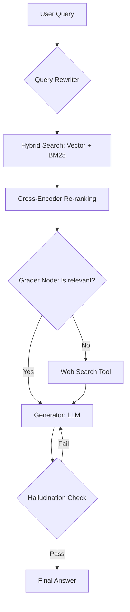

# Advanced Agentic RAG System: Self-Corrective Retrieval & Evaluation

Hệ thống RAG nâng cao tích hợp khả năng tự sửa lỗi (Self-Correction), tìm kiếm lai (Hybrid Search) và quy trình đánh giá nghiêm ngặt bằng RAGAS. Dự án sử dụng **Poetry** để quản lý dependency và tuân thủ cấu trúc **src-layout** chuẩn kiến trúc phần mềm chuyên nghiệp.

## 🏗 System Architecture

Hệ thống được xây dựng dựa trên kiến trúc **Agentic RAG** sử dụng **LangGraph** để quản lý trạng thái và luồng xử lý.



## 🚀 Key Features

* **Poetry Managed:** Quản lý môi trường ảo và thư viện chặt chẽ, hỗ trợ tách biệt dependencies cho Development và Evaluation.
* **Ingestion Pipeline:** Sử dụng **Semantic Chunking** để phân tách dữ liệu dựa trên ngữ nghĩa.
* **Advanced Retrieval:** Kết hợp **Vector Search** (Dense) và **BM25** (Sparse).
* **Agentic Reasoning (LangGraph):** Triển khai luồng **Self-RAG** cho phép Agent tự đánh giá chất lượng tài liệu.
* **Evaluation-Driven Development:** Tích hợp bộ công cụ **RAGAS** và **DeepEval** trực tiếp vào workflow.

## 📁 Project Structure

Dự án sử dụng `src-layout` để bảo vệ mã nguồn và đảm bảo tính đóng gói:

```text
├── .github/workflows/       # CI/CD cho testing & evaluation tự động
├── src/                     # Mã nguồn chính (Internal Package)
│   ├── ingestion/           # Pipeline xử lý PDF, OCR, Chunking
│   ├── indexing/            # Logic tạo Vector/Graph Index
│   ├── retrieval/           # Hybrid search, Re-ranking
│   ├── agents/              # Định nghĩa LangGraph state & nodes
│   └── app/                 # FastAPI Interface
├── evaluation/              # RAGAS/DeepEval test suites & datasets
├── pyproject.toml           # Cấu hình Poetry & Dependencies
├── docker-compose.yml       # Setup Qdrant, Redis, Ollama
└── README.md

```

## 🛠 Quick Start

### 1. Yêu cầu hệ thống

* Python >= 3.12
* Poetry >= 2.0.0

### 2. Cài đặt

```bash
# Clone repository
git clone https://github.com/nhatkhoanguyen204/advanced-rag-langgraph-agent.git
cd advanced-rag-langgraph-agent

# Cài đặt dependencies (Production only)
poetry install --only main

# Cài đặt thêm nhóm Evaluation (nếu cần test)
poetry install --with eval

```

### 3. Cấu hình & Khởi chạy

1. Tạo file `.env` từ mẫu và thêm các API Key cần thiết (`OPENAI_API_KEY`, `TAVILY_API_KEY`, v.v.).
2. Khởi chạy ứng dụng qua Docker:

```bash
docker-compose up --build

```

Hệ thống sẽ khởi chạy API tại `localhost:8000`.

## 📊 Evaluation Results

Chúng tôi đo lường hiệu quả trên tập dữ liệu mẫu thông qua nhóm `eval` trong Poetry:

| Metric | Naive RAG | **Advanced Agentic RAG** |
| --- | --- | --- |
| **Faithfulness** | 0.62 | **0.91** |
| **Answer Relevancy** | 0.58 | **0.88** |
| **Context Precision** | 0.45 | **0.82** |

## 🛡 License

Dự án được phát hành dưới bản quyền **MIT License**.
