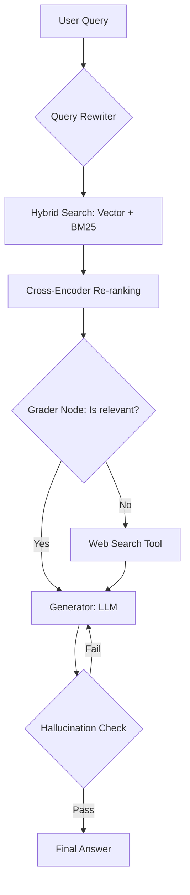

# Advanced Agentic RAG System: Self-Corrective Retrieval & Evaluation

Hệ thống RAG nâng cao tích hợp khả năng tự sửa lỗi (Self-Correction), tìm kiếm lai (Hybrid Search) và quy trình đánh giá nghiêm ngặt bằng RAGAS. Dự án này không chỉ là một ứng dụng AI mà là một hệ thống phần mềm có khả năng quan sát và đo lường được.

## 🏗 System Architecture

Hệ thống được xây dựng dựa trên kiến trúc **Agentic RAG** sử dụng **LangGraph** để quản lý trạng thái và luồng xử lý.



## 🚀 Key Features

* **Ingestion Pipeline:** Sử dụng **Semantic Chunking** để phân tách dữ liệu dựa trên ngữ nghĩa thay vì độ dài ký tự cố định.
* **Advanced Retrieval:** Kết hợp **Vector Search** (Dense) và **BM25** (Sparse) để tối ưu hóa độ chính xác cho cả từ khóa và ngữ cảnh.
* **Agentic Reasoning (LangGraph):** Triển khai luồng **Self-RAG** cho phép Agent tự đánh giá chất lượng tài liệu truy hồi và thực hiện tìm kiếm lại nếu cần thiết.
* **Evaluation-Driven Development:** Tích hợp bộ công cụ đánh giá tự động cho mỗi lần thay đổi mã nguồn.

## 📁 Project Structure

```text
├── .github/workflows/       # CI/CD cho testing & evaluation tự động
├── src/
│   ├── ingestion/           # Pipeline xử lý PDF, OCR, Chunking
│   ├── indexing/            # Logic tạo Vector/Graph Index
│   ├── retrieval/           # Hybrid search, Re-ranking
│   ├── agents/              # Định nghĩa LangGraph state & nodes
│   └── app/                 # FastAPI/Streamlit Interface
├── evaluation/              # RAGAS/DeepEval test suites
├── docker-compose.yml       # Setup Qdrant, Redis, Ollama một chạm
└── requirements.txt         # Dependencies

```

## 📊 Evaluation Results

Chúng tôi sử dụng khung đánh giá **RAGAS** để đo lường hiệu quả của hệ thống trên tập dữ liệu mẫu (`data/synthetic_dataset.json`):

| Metric | Naive RAG | **Advanced Agentic RAG** |
| --- | --- | --- |
| **Faithfulness** | 0.62 | **0.91** |
| **Answer Relevancy** | 0.58 | **0.88** |
| **Context Precision** | 0.45 | **0.82** |

## 🛠 Quick Start

1. **Clone repository:**
```bash
git clone https://github.com/nhatkhoanguyen204/advanced-rag.git
cd advanced-rag

```


2. **Cấu hình môi trường:** Tạo file `.env` và thêm `OPENAI_API_KEY`, `TAVILY_API_KEY`.
3. **Khởi chạy bằng Docker:**
```bash
docker-compose up --build

```


Hệ thống sẽ khởi chạy tại `localhost:8501` (Streamlit UI).

## 🛡 License

Dự án được phát hành dưới bản quyền **MIT License**.
